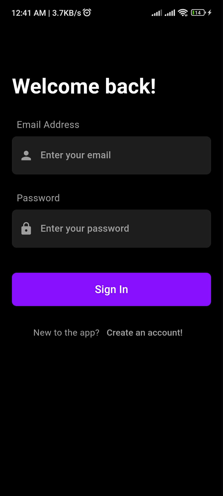
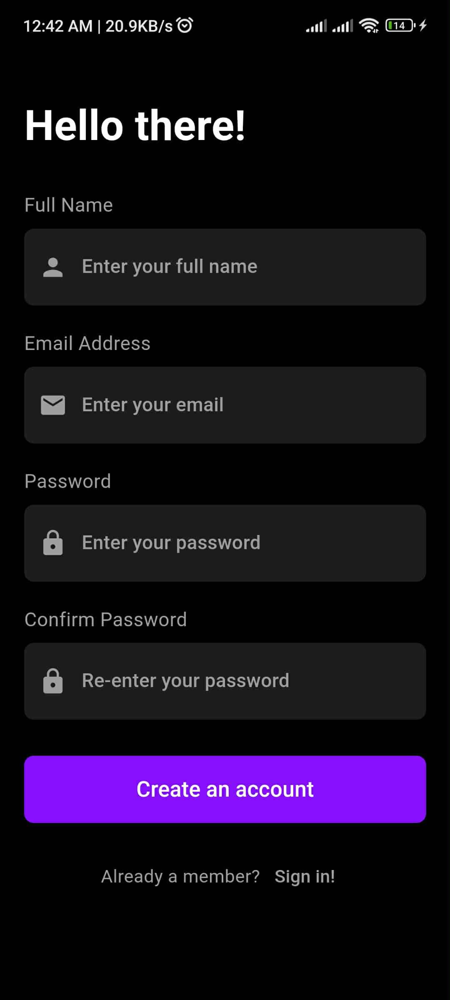
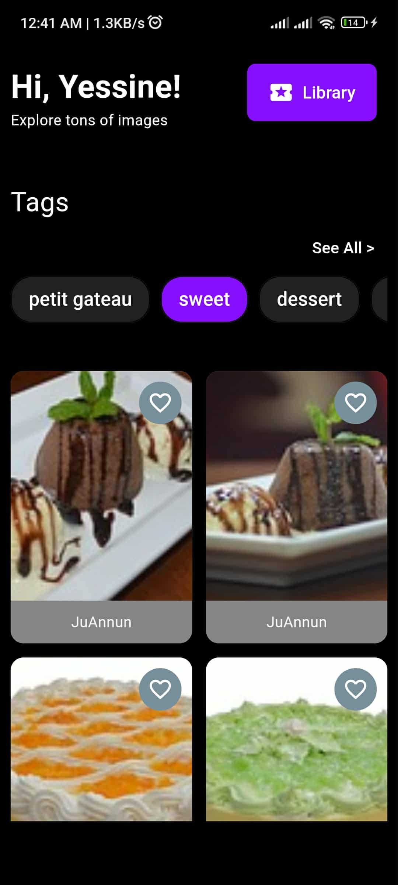

# 🎂 CakeGallery – Explorez, Enregistrez et Inspirez 🍰

Bienvenue dans **CakeGallery**, une application mobile développée avec **Flutter**, inspirée du concept de **Pinterest**, dédiée exclusivement aux amateurs de **gâteaux**.  
Elle permet aux utilisateurs d’explorer des idées de gâteaux, d’enregistrer leurs favoris et de créer une bibliothèque personnelle d’inspirations gourmandes. 🎀

---

## ✨ Fonctionnalités principales

- 🧁 **Exploration visuelle** : Découvrez une large collection d’images de gâteaux provenant de la communauté.
- ❤️ **Ajout aux favoris** : Sauvegardez vos gâteaux préférés pour les retrouver facilement.
- 🔍 **Recherche intelligente** : Trouvez des gâteaux par type, couleur ou style.
- 🗂️ **Bibliothèque personnelle** : Accédez à tous vos gâteaux favoris dans un espace dédié.
- 🌐 **Intégration API Pixabay** : Les images sont automatiquement chargées depuis l’API Pixabay.
- 💾 **Persistance des favoris** : Vos choix sont enregistrés même après la fermeture de l’application.


---

## 🏗️ Technologies utilisées

- **Flutter** (Framework multiplateforme)
- **Dart** (Langage principal)
- **HTTP** (Appels API à Pixabay)
- **Pixabay API** (Source des images)

---

## 📱 Aperçu de l’application

<p align="center">


  
  
  
</p>

---

## ⚙️ Installation

1. Clone le projet :
   ```bash
   git clone https://github.com/<ton-nom-utilisateur>/cake_gallery.git
